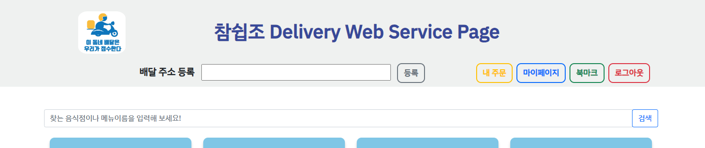
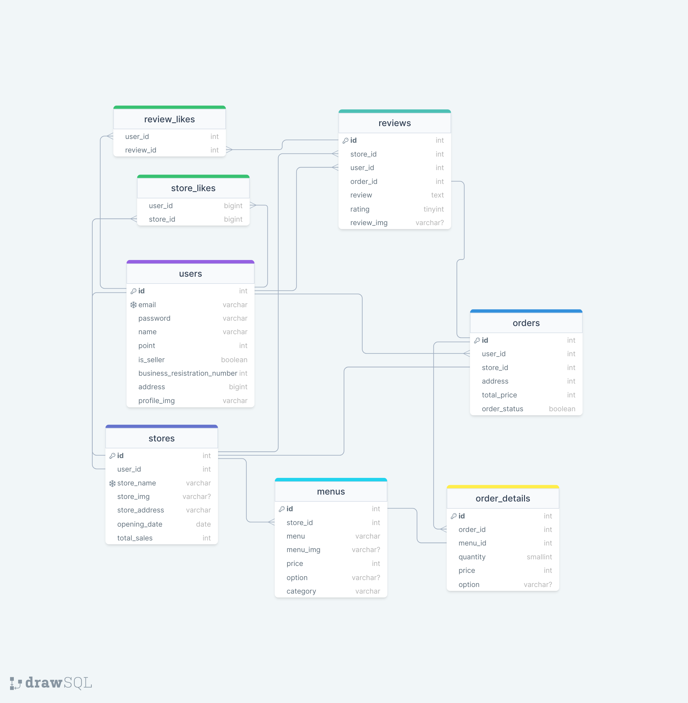

# 🛵Delivery Project

## 프로젝트 목적

> 직접 개발 환경을 마련하고 실제 서비스를 개발하면서 경험을 쌓는 것이 목적입니다.  
> 간접적으로 실제 work flow에 대해 맛보기로 경험하고 이해해보는 과정이라고 할 수 있습니다.  
> node.js 기반 express 프레임워크를 활용하여 음식 배달 서비스를 구현했습니다.

## ERD

## API 명세

| Path                                 | API Method | Verify |             Description              |
| ------------------------------------ | :--------: | :----: | :----------------------------------: |
| /users/signup                        |    POST    |        |               회원가입               |
| /users/login                         |    POST    |        |                로그인                |
| /users/kakao                         |    GET     |        |             카카오로그인             |
| /users/kakao/callback                |    GET     |        |       카카오로그인 or 회원가입       |
| /users/kakao/signup/:kakaoEmail      |    POST    |        |            카카오회원가입            |
| /users/logout                        |    POST    |        |               로그아웃               |
| /users                               |   PATCH    |   ✔    |            유저정보 수정             |
| /user/myReviews                      |    GET     |   ✔    |           내 리뷰목록 조회           |
| /user/myOrders                       |    GET     |   ✔    |           내 주문목록 조회           |
| /user/store/:storeId/like            |    POST    |   ✔    |             매장 좋아요              |
| /user/store/likeStores               |    GET     |   ✔    |           좋아요 매장 조회           |
| /stores/search                       |    POST    |        |              매장 검색               |
| /stores/ranking                      |    POST    |        | 기간별 매장 랭킹조회(주문 건수 기준) |
| /stores/reorderRanking               |    GET     |        |        매장별 재주문 랭킹조회        |
| /store/registration                  |    POST    |   ✔    |            매장정보 등록             |
| /store/registration                  |   PATCH    |   ✔    |            매장정보 수정             |
| /store/registration                  |   DELETE   |   ✔    |            매장정보 삭제             |
| /store/menu                          |    POST    |   ✔    |              메뉴 등록               |
| /store/menu/:menuId                  |   PATCH    |   ✔    |              메뉴 수정               |
| /store/menu/:menuId                  |   DELETE   |   ✔    |               메뉴삭제               |
| /store/:storeId/menus                |    GET     |        |          매장 메뉴 전체조회          |
| /store/:storeId/review               |    POST    |   ✔    |               리뷰등록               |
| /store/:storeId/review/:reviewId     |   PATCH    |   ✔    |               리뷰수정               |
| /store/:storeId/review:reviewId      |   DELETE   |   ✔    |               리뷰삭제               |
| /store/:storeId/review:reviewId/like |   DELETE   |   ✔    |             리뷰 좋아요              |
| /order/:orderId                      |    GET     |   ✔    |            배달상태 확인             |
| /order/:orderId/refundRequest        |    GET     |   ✔    |         주문취소(환불) 요청          |
| /order/:orderId/refundComplete       |    GET     |   ✔    |              환불 완료               |
| /order/:orderId/refundRefuse         |    GET     |   ✔    |       주문취소(환불) 요청 거절       |
| /order/store/:storeId                |    POST    |   ✔    |          음식 주문(여러개)           |

[상세 API 명세보기](https://charming-castanet-ba9.notion.site/17e5fa0a09b94064a39e9c468625352a?v=7ca9b026f7c4438ba77a6186aa7dbcb6)

## 역할 분담

| 이름   | 기능 구현 및 역할                                                                                                                             |
| ------ | --------------------------------------------------------------------------------------------------------------------------------------------- |
| 박성민 | 메뉴주문, 주문확인 및 배달 완료처리, 환불기능, 매장 즐겨찾기, 배달관련 실시간 알림기능 구현(socket.io) / 각 프론트엔드 병합 및 CSS style 통일 |
| 류원희 | 매장 및 메뉴 CRUD 일체 기능 구현 / 프론트엔드 연결, 매장 및 메뉴 CSS 작업                                                                     |
| 이승준 | 회원가입 및 로그인, 유저 CRUD, 이메일인증, 소셜로그인, 검색 기능 구현 / 프론트엔드 연결, CSS 작업                                             |
| 이상훈 | 리뷰 CRUD, 리뷰 좋아요, 주문 건수별/재주문율 기준 간단한 매장 랭킹기능 구현/ 프론트엔드 연결, CSS작업                                         |

> ⭕'COMPLTED LIST'
>
> - [x] 프로젝트 요구사항 중 필수구현 사항 구현
> - [x] nodemailer를 사용하여 이메일 인증 구현
> - [x] AWS S3를 사용하여 매장/유저/리뷰 이미지 업로드 및 프론트 출력 구현
> - [x] 소셜로그인 간단한 구현
> - [x] 에러 문구 모듈화
> - [x] socket.io를 활용한 실시간 알림기능 구현 (백엔드만, 프론트는 시간상 미적용)
> - [x] 간단한 랭킹기능(주문건수별, 재주문율) 구현 (프론트는 재주문만 사용중)

---

## [시연 영상](https://www.youtube.com/watch?v=phyM0muRtjo)

## Problems

- 박성민 : socket.io에 대한 이해도가 많이 없는 상태였고, 강의내용만으로는 구현하는게 쉽지 않았습니다. 따라서 초반 연결하는 과정에서 시간을 많이 뺏겨가지고 프론트까지는 연결하지 못한 점이 많이 아쉽습니다.  
  각 프론트를 연결해주는 과정에서도 사소한 오류가 많았다보니 전체적으로 시간이 부족하다고 느껴졌습니다.

- 이상훈 : 기존에 작성되어있던 에러코드나 예외처리를 모듈화 시키는 과정에서 한번에 다 바꾸려고 하다보니까 자잘한 문제가 많았습니다. 결론적으로 모듈화 후에 테스트 하는 과정에서 에러메세지의 경로가 나오지 않다보니 정확히 어느부분에서 에러가 나오는지를 파악하는게 어려웠습니다. 나중에 알아보니 에러클래스를 지정할때 stack trace값을 넣어줄 수 있다는걸 알게되어서 개선할 예정입니다.

- 류원희 : 트랜잭션 적용하는 과정에서, 기존 하나의 라우터 내에서 적용하는 방법에 비해 3 layered architecture pattern에서 적용하는 방법이 조금 달라 어려움이 있었습니다. 또, forEach나 map등 반복문 메서드에서 async-await이 적용되지 않는다는 것을 몰라서 조금 헤멨습니다.
  프론트 작업 간 여러가지 음식을 동시에 주문하는 코드를 구현할 때 선택자에 대한 이해도가 늘었다고 느낍니다.

- 이승준 : 생각보다 프론트 연결하는 과정이 어려웠습니다. 사용하는 API가 많다보니 변수명을 지정하는 것도 개수가 늘어나다보니까 헷갈렸고, 코드의 가독성이 떨어지다 보니 유지보수가 어려웠습니다.  
  소셜로그인 구현할 때 Access Token 관리 하는 부분이 이해가 잘 안되었어서 어려움이 있었습니다. 아직은 이해가 잘 되지 않아서 Session으로 연결하지 않고 DB와 직접 연결하여 구현했습니다.
